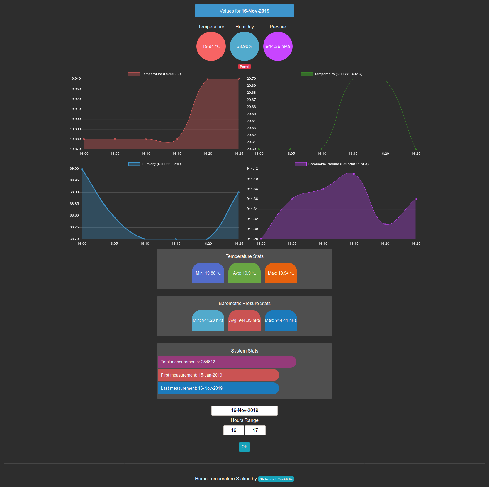

# Home logs

You have some sensors and you would like to monitor their values. This backend system can save data and create some interesting graphs.

### Prerequisites

You can clone and use this as a normal Django app. This is not a tutorial on installing Django, sorry...


### Installing

Install project requirements with:

```
pip install -r requirements.txt
```

## Using API

For using the api endpoints with your clients like custom weather stations or arduino/raspberry see the [API.md](README_API.md) file for instructions

## Built With

* [Django](https://www.djangoproject.com/) - The web framework for perfectionists with deadlines.
* [DRF](https://www.django-rest-framework.org/) - Django REST framework is a powerful and flexible toolkit for building Web APIs.

## Contributing

Fell free to give advice, code reviews or any other ideas

## Authors

* **Stefanos I. Taklidis** - *Initial work* - [tsaklidis.gr](https://tsaklidis.gr)

## Screens



## License

This project is licensed under the MIT License - see the [LICENSE.md](LICENSE.md) file for details

## Acknowledgments

* System can be unstable. Use with your own risk

